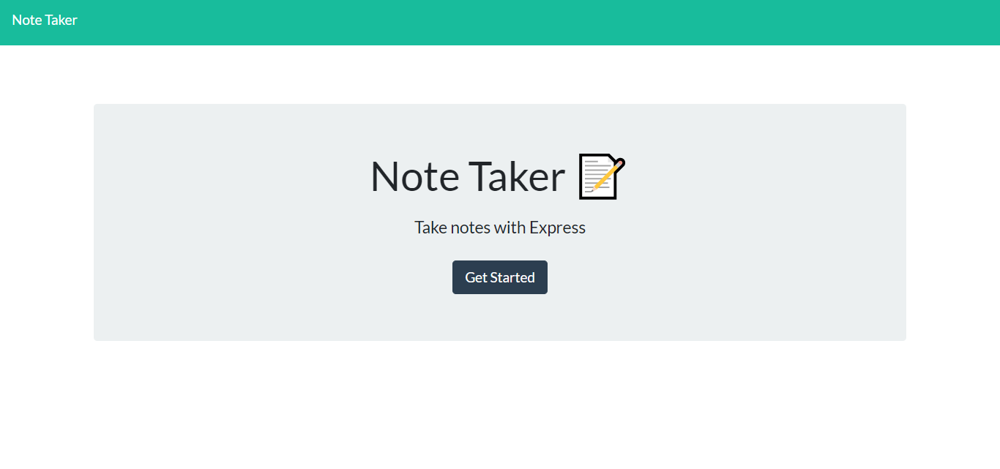
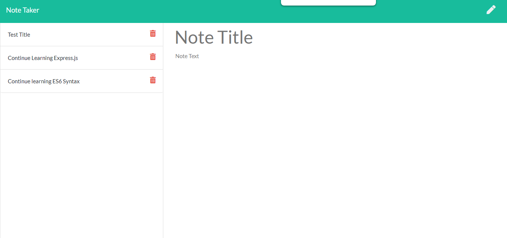

# JSON_Note_Taker

## Function 
- This Note Taker app uses a server side API created with the Express.js framework. This application quickly establishes an API route to dynamically created HTML, using HTTP request methods. 

- Routing is used to handle responses a client makes on front end and passes a request to the server side end, triggering a specific endpoint or URL. 

 

## Intended Use
- This application is created with the student, busy career individual or simply the compulsive note taker. Much more robust than just a JavaScript Note Taker or Todo List, this application uses a server side API to get, post, or delete content across all browsers and computers. 

## List of links/dependencies

- fs-js
- https://www.npmjs.com/package/fs-js
- express.js
- https://www.npmjs.com/package/express 

Deployed URL
- https://sleepy-brushlands-91134.herokuapp.com/notes
